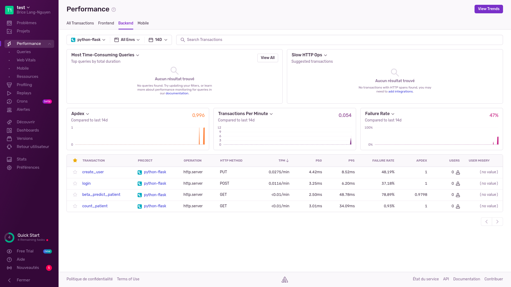
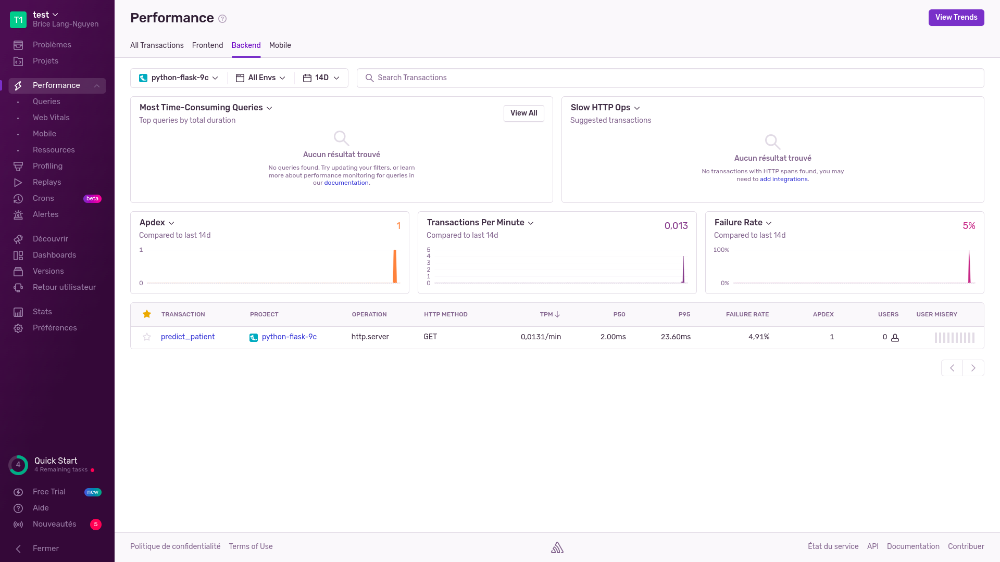

### REQUIREMENTS

- Docker ([https://docs.docker.com/get-docker/](https://docs.docker.com/get-docker/))
- Docker-compose ([https://docs.docker.com/compose/install/](https://docs.docker.com/compose/install/))

### RUN SERVICES

```bash
$ docker-compose build
```
```bash
$ docker-compose up
```

The REST API can be accessed at the following address: [http://127.0.0.1:5000](http://127.0.0.1:5000)

In this mode, the second API with /predict_patient endpoint and mongoDB are not accessible from the outside.

### RUN API TESTS AND COVERAGE

```bash
$ docker-compose -f docker-compose_test.yml build
```
```bash
$ docker-compose -f docker-compose_test.yml up
```

The result of the coverage can be seen by opening the page **index.html** inside **htmlcov** folder.

In this mode, all APIs and mongoDB are accessible from the outside.

### USEFUL INFORMATION

#### DATABASE CREDENTIALS
The database connection credentials are in the .env file located at the root of /app.  

#### DEFAULT USER PASSWORD
The default user password is 'password'.

#### DUPLICATE OF MODELS AND SCHEMA PACKAGES
**Unfortunately, the python package containing the models/ and schema/ folders when copied into the docker was not detected by python, which is why a copy is included in app/ and predict_app/. One solution would be to import the package via a github repo to get around the problem.**

#### WHY SENTRY
[Sentry](https://sentry.io/) is used to monitor the performance (p50, p99, TPM) of each route and track errors.


